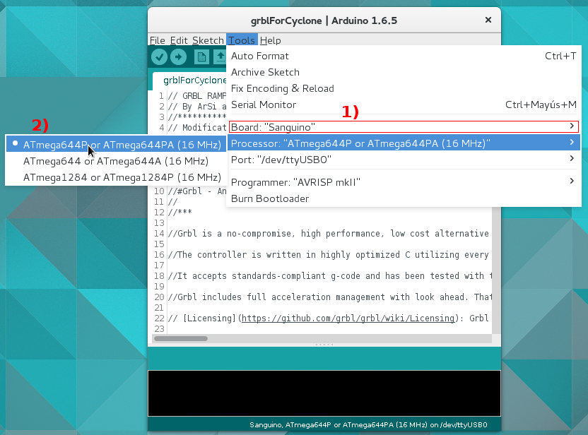

# If you are using Sanguinololu

It is necessary to install the Sanguinololu board into the Arduino IDE before being able to compile and flash the GRBL firmware.  

For this, copy the Sanguinololu folder into the hardware/ folder of the Arduino IDE (often located in the Sketchbook library)  

**Note:** If you have problems programming the Sanguinololu, you may need to change the baud rate (upload.speed=XXXXX) in "Sanguino/avr/boards.txt". Try values: 38400, 57600, and 115200.  
If problems persist, refer to: <http://reprap.org/wiki/Sanguinololu#Troubleshooting>  

Result
--

Then running the Arduino IDE, you'll see new options in the "Tools" menu:  

**ATmega644P** is probably the one on board your Sanguinololu.  

Developed by Kristian Sloth Lauszus, 2012
--
Obtained from: <https://github.com/Lauszus/Sanguino>  
The code is released under the GNU General Public License.

